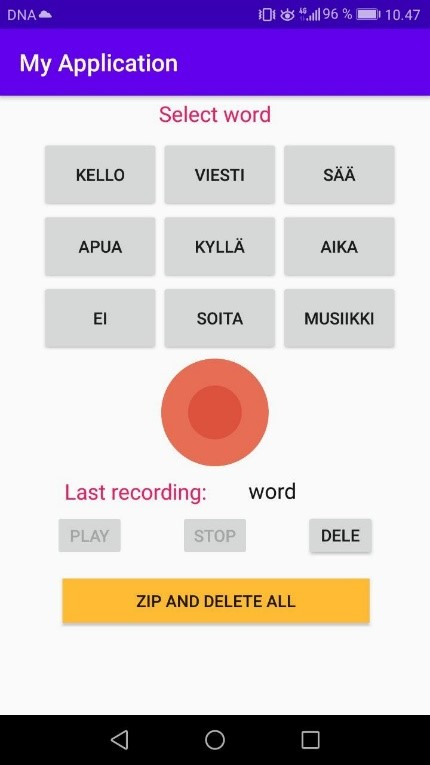

# datasetRecorder

1. Select a word

2. Press record

3. Say the word

4. Press stop

5. Audio is saved to [SD CARD root] / Audio / [word]. Audio files go to directory with corresponding word as name

6. You can play it back to see if its good, if not delete

7. When you want to transfer files from phone to PC press “zip and delete all” button. It makes zip file (PATH: [SD CARD root] / zippedAudio) with all recorded audio in right folders and deletes original audio files, so you can continue recording and there is no duplicates when you make zip file again.

8. Open Google Drive app on phone and add zip file there

